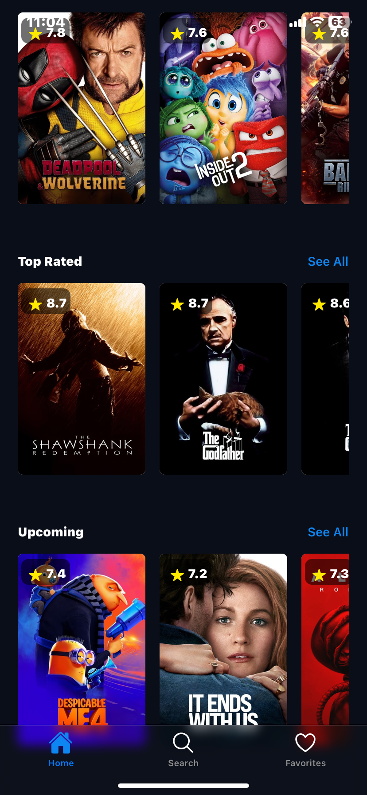
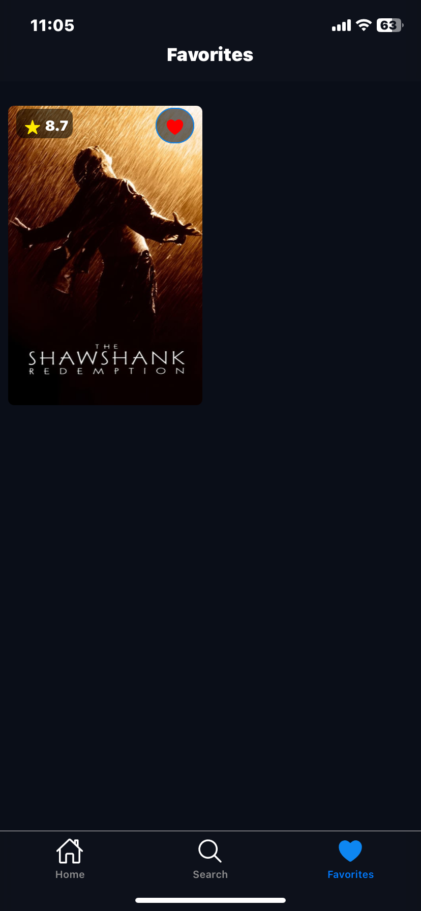
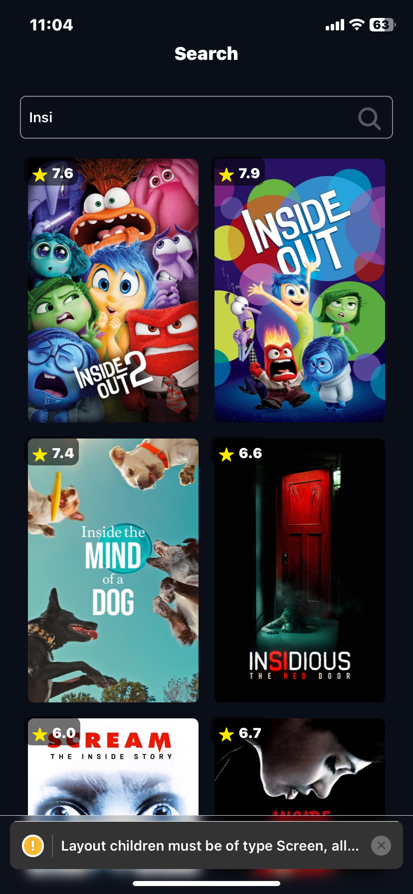
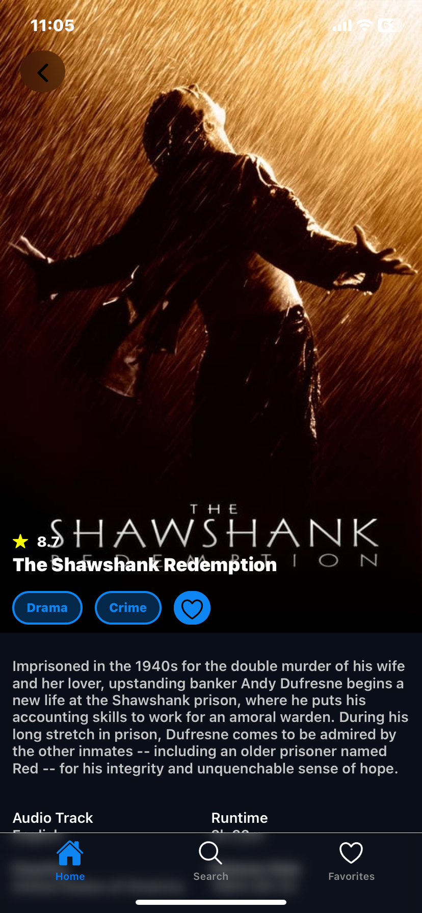
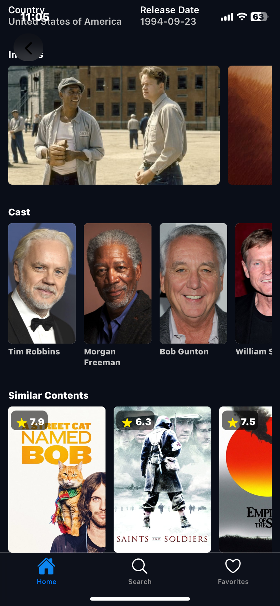
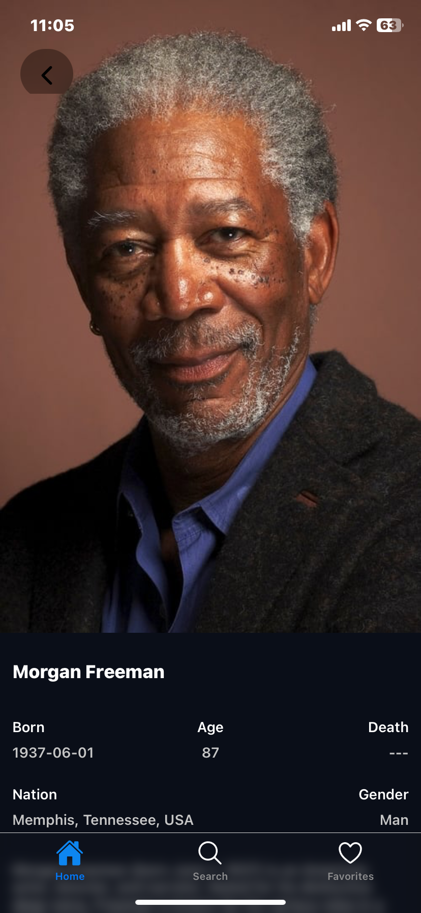

# Movie App

Welcome to the **Movie App**, an Expo-based application built with React Native and TypeScript. This app interacts with the MovieDB endpoints, allowing users to explore various categories of movies, view detailed information, and manage their favorite films. Additionally, users can discover actors' biographies and find other movies they have appeared in.

## Features

- **Browse Movies**: Explore movies in different categories.
- **Movie Details**: View detailed information about each movie, including plot summaries, ratings, and release dates.
- **Favorite Movies**: Add movies to your list of favorites for easy access.
- **Actor Information**: Learn more about the actors in the movies, including their biographies and filmographies.
- **Responsive UI**: A clean and intuitive interface designed with TailwindCSS (NativeWind) and optimized for mobile devices.

## Technologies Used

- **React Native**: For building the mobile application.
- **Expo**: For development, build, and deployment.
- **TypeScript**: To add static typing and improve code quality.
- **TailwindCSS (NativeWind)**: For styling the application.
- **Expo Router**: To handle the navigation structure.
- **Zustand**: For state management.
- **React Native Async Storage**: For local storage management.
- **Reanimated**: For smooth animations and gestures.

## Download

You can download the latest version of the Movie App here:

[Download Movie App APK](https://github.com/furkancan05/movie-app/releases/download/v1.1/movie-app.apk)

## Screenshots

Here are some screenshots of the app:

## Getting Started

Follow these instructions to set up the project locally.

### Prerequisites

- **Node.js** and **npm** or **yarn**
- **Expo CLI**

### Installation

1. Clone the repository:
   \`\`\`bash
   git clone https://github.com/furkancan05/movie-app.git
   \`\`\`
2. Navigate to the project directory:
   \`\`\`bash
   cd movie-app
   \`\`\`
3. Install dependencies:
   \`\`\`bash
   npm install
   \`\`\`
   or
   \`\`\`bash
   yarn install
   \`\`\`

### Running the App

Start the Expo development server:
\`\`\`bash
npx expo start
\`\`\`

Scan the QR code with your Expo Go app (available on iOS and Android) or run the app on an emulator.

## Contributing

If you'd like to contribute, please fork the repository and use a feature branch. Pull requests are warmly welcome.
